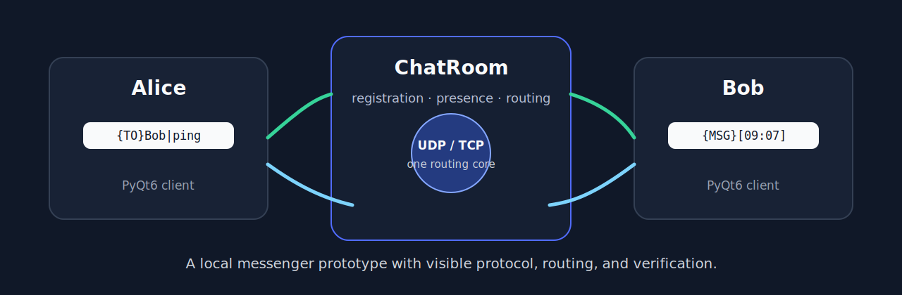
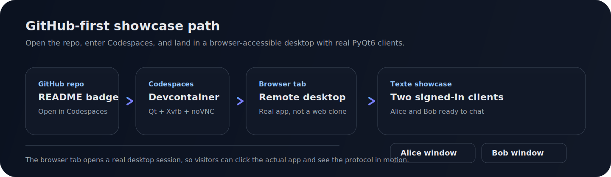
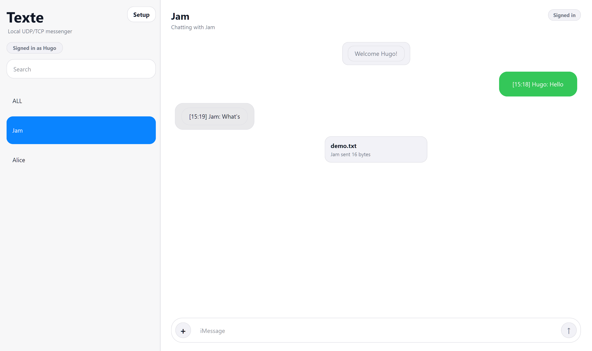

<div align="center"><a name="readme-top"></a>

# Texte — PyQt6 UDP/TCP Messenger

[](https://www.python.org/)
[](#try-it-in-30-seconds)
[](#supported-scope)
[](#testing--verification)
[](https://codespaces.new/sabneet-bains/Texte-Messenger?quickstart=1)
[](LICENSE)

**A local desktop messenger with visible protocol, routing, and verification.**

<sup><i>PyQt6 client, UDP/TCP servers, presence, direct messages, and small TCP attachment transfer without production-sized claims.</i></sup>



</div>

<br>

> [!IMPORTANT]
> Texte is a local messenger prototype. It is not a secure messenger, not a
> production chat service, and not a cloud platform.

<br>

## 🚀 Play in Codespaces

[](https://codespaces.new/sabneet-bains/Texte-Messenger?quickstart=1)

Open the repo from GitHub, wait for the Codespace to finish booting, and the browser tab lands in a real desktop session. `texte-showcase` starts two signed-in clients, a local server, and a short starter transcript so the app is immediately interactive.

<div align="center">



</div>

The browser path is documented in [docs/showcase.md](docs/showcase.md).

<br>

## 🧭 Navigation

| Goal | Start here | What you will see |
|:--|:--|:--|
| **Play in browser** | [Play in Codespaces](#play-in-codespaces) | Browser-accessible desktop session with the real PyQt app |
| **Understand the project** | [Project Highlights](#project-highlights) | Core capabilities and evidence in one minute |
| **Run it quickly** | [Try It in 30 Seconds](#try-it-in-30-seconds) | Copy-paste demo commands with real output |
| **Inspect the design** | [Architecture & Design](#architecture--design) | Package layout, data flow, tradeoffs, and limits |
| **Verify behavior** | [Testing & Verification](#testing--verification) | Tests, demos, lint, compile, and build commands |

<br>

## 🏆 Project Highlights

Texte turns a desktop chat mockup into a real, inspectable local messenger.

| Signal | Evidence in this repo |
|:--|:--|
| **Desktop UI** | PyQt6 client with a Messages-style shell, setup sheet, Light/Dark themes, message bubbles, and attachment controls |
| **Networking** | Local UDP and TCP servers using `PyQt6.QtNetwork` |
| **Protocol design** | Small command-prefixed protocol with explicit TCP framing |
| **Routing** | Shared `ChatRoom` core for registration, presence, public messages, direct messages, and disconnect cleanup |
| **Attachments** | Small TCP-only file payloads with size checks and local saving |
| **Engineering rigor** | Scripted demos, expected transcripts, tests, docs, package metadata, and CI |

### Project Snapshot

| Metric | Current Value |
|:--|:--|
| **Package** | `texte` |
| **Desktop toolkit** | PyQt6 |
| **Server modes** | UDP and TCP |
| **Client commands** | `{CONNECT}`, `{DISCONNECT}`, `{REGISTER}`, `{UNREGISTER}`, `{ALL}`, `{TO}`, `{FILE}` |
| **Server messages** | `{MSG}`, `{USERS}`, `{ERROR}`, `{FILE}` |
| **Scripted demos** | TCP and UDP two-client demos |
| **Showcase launcher** | `texte-showcase` for the browser-ready Codespaces session |
| **Collected tests** | 55 |
| **CI** | Ruff, mypy, format check, compile, pytest, demo smoke checks, package build |

<br>

## ⚡ Try It in 30 Seconds

Install and run the test suite:

```bash
python -m pip install -e ".[dev]" && python -m pytest
```

Expected result:

```text
55 passed
```

Run the deterministic TCP demo:

```bash
python examples/two_client_demo.py --protocol tcp
```

Output shape:

```text
Alice signed in
Bob signed in
Bob received public message: [09:52] Alice: hello
Bob received direct message: [09:52] Alice -> Bob: private ping
Bob received file: demo.txt from Alice (16 bytes)
```

Run the UDP path:

```bash
python examples/two_client_demo.py --protocol udp
```

```text
Alice signed in
Bob signed in
Bob received public message: [09:52] Alice: hello
Bob received direct message: [09:52] Alice -> Bob: private ping
UDP demo skipped file transfer; attachments are TCP-only.
```

<br>

## 🖥️ Open The Desktop App

Start the desktop client:

```bash
python client.py
```

By default, the client checks for a local TCP server on `127.0.0.1:33002`.
If one is not running, it starts one in the background, signs in with the
display name in setup, and shows other local clients as they appear.

Open a second client window to chat locally:

```bash
python client.py
```

Manual server commands remain available for demos and advanced use:

```bash
python server.py tcp
python server.py
```

Installed entry points are also available:

```bash
texte-server tcp
texte-server
texte-client
texte-showcase
python -m texte
```

The setup sheet keeps advanced controls for host, port, transport, display
name, avatar, theme, and automatic local-server startup. Attachments require
TCP mode.

<details>
<summary>Show current desktop screenshot</summary>

<br>

<div align="center">



</div>

</details>

<br>

<div align="right">

[](#readme-top)

</div>

<br>

## ⚙️ Architecture & Design

```text
Texte-Messenger/
├── texte/
│   ├── client.py          # ChatClient state, events, validation, rendering
│   ├── client_support.py  # Small conversion and list-item helpers for the client
│   ├── server.py          # UDP/TCP server adapters and TCP framing
│   ├── chat_room.py       # Shared registration, presence, and routing logic
│   ├── protocol.py        # Message constants, parsing, formatting, framing
│   ├── ui.py              # Layout-based PyQt6 widget construction
│   ├── themes.py          # Built-in color palettes
│   └── assets/            # Icons, avatars, screenshot, README hero
├── examples/              # Scripted local demos and expected transcripts
├── docs/                  # Protocol, correctness notes, tutorial, code tour
├── tests/                 # Unit, GUI, demo, and network integration tests
├── client.py              # Compatibility wrapper for python client.py
├── server.py              # Compatibility wrapper for python server.py
├── pyproject.toml         # Package metadata, entry points, dev tools
├── CONTRIBUTING.md
├── CHANGELOG.md
└── LICENSE
```

### Data Flow

```text
client action
  -> protocol command
  -> UDP datagram or TCP frame
  -> server socket adapter
  -> ChatRoom.route(...)
  -> explicit deliveries
  -> client display, presence update, or saved file
```

### Design Principles

| Principle | How it appears |
|:--|:--|
| **One routing source** | UDP and TCP both use `ChatRoom`, so behavior does not drift by transport. |
| **Protocol stays visible** | Commands are plain strings, parsed by small helpers, and covered by tests. |
| **TCP is treated honestly** | TCP uses newline frames because stream reads can split or merge messages. |
| **UI is layout-based** | `ui.py` uses Qt layouts instead of fixed widget geometry. |
| **Limits are explicit** | Unsupported scope is documented instead of hidden behind broad claims. |

### Design Tradeoffs

| Decision | Why it improves the project |
|:--|:--|
| **Local-first server** | Keeps the demo runnable without accounts, hosting, or cloud setup. |
| **Display names, not identities** | Avoids pretending to provide authentication. |
| **TCP-only attachments** | Keeps file transfer reliable without inventing UDP chunking. |
| **Small command protocol** | Makes routing inspectable and beginner-readable. |
| **Package plus wrappers** | Gives clean imports while preserving simple `python client.py` commands. |

<br>

<div align="right">

[](#readme-top)

</div>

<br>

## 📌 Supported Scope

| Area | Current Support |
|:--|:--|
| **Desktop client** | PyQt6 dialog with conversation list, setup sheet, Light/Dark themes, message bubbles, and attachments |
| **UDP** | Local datagram server and client messaging |
| **TCP** | Local stream server with newline-framed commands |
| **Presence** | Server sends `{USERS}` updates after registration changes |
| **Public messages** | `ALL` broadcasts to registered clients |
| **Direct messages** | `{TO}recipient|text` routes to the sender and target |
| **Attachments** | Small TCP-only payloads routed as `{FILE}` and saved into `downloads/` |
| **Packaging** | `texte-client`, `texte-server`, and `python -m texte` entry points |

### Known Limits

- No encryption or authentication.
- No persistent accounts, database, or chat history.
- No offline delivery or message replay.
- No group rooms beyond the public `ALL` room.
- Attachments are intentionally small and local-demo oriented.
- UDP does not transfer files.
- No `asyncio` or manual threading in the app; Qt owns the event loop.
- The interface is tuned for desktop windows, not mobile-sized screens.

<br>

<div align="right">

[](#readme-top)

</div>

<br>

## 🧪 Protocol & Examples

Direct messages are explicit:

```python
from texte.protocol import chat_message, frame_message

print(chat_message("Bob", "private ping"))
print(frame_message("{REGISTER}Alice"))
```

```text
{TO}Bob|private ping
b'{REGISTER}Alice\n'
```

The routing core is pure Python:

```python
from texte.chat_room import ChatRoom

room = ChatRoom()
room.route("alice", "{REGISTER}Alice", "127.0.0.1:1")
room.route("bob", "{REGISTER}Bob", "127.0.0.1:2")
result = room.route("alice", "{TO}Bob|private ping", "127.0.0.1:1")

for delivery in result.deliveries:
    print(delivery.recipient, delivery.message)
```

```text
bob {MSG}[HH:MM] Alice -> Bob: private ping
alice {MSG}[HH:MM] Alice -> Bob: private ping
```

Expected demo transcripts live in `examples/expected/` and are checked by tests.

<br>

<div align="right">

[](#readme-top)

</div>

<br>

## ✅ Testing & Verification

Install with development dependencies:

```bash
python -m pip install -e ".[dev]"
```

Run the full local verification set:

```bash
python -m ruff check .
python -m ruff format --check .
python -m mypy texte examples tests
python -m compileall client.py server.py texte tests examples
python -m pytest
python examples/two_client_demo.py --protocol tcp
python examples/two_client_demo.py --protocol udp
python -m build
texte-showcase --help
```

Current coverage focuses on:

- protocol formatting, parsing, validation, file payloads, and TCP framing
- registration, duplicate-name rejection, presence, public routing, direct
  routing, disconnect cleanup, and transport-specific attachment errors
- real UDP and TCP socket integration
- scripted demo output against expected transcripts
- offscreen PyQt6 client construction
- Light/Dark theme completeness
- layout-based UI source guard

CI runs lint, type checking, format check, compile, tests, package build, demo
smoke checks, and the showcase help check on Python 3.12 and 3.13.

<br>

<div align="right">

[](#readme-top)

</div>

<br>

## 📚 Design Notes

- [Code Tour](docs/code-tour.md) explains what each source file owns.
- [Correctness Notes](docs/correctness.md) describe the verification strategy.
- [Showcase Path](docs/showcase.md) explains the browser-first Codespaces flow.
- [Protocol Notes](docs/protocol.md) list wire commands and limits.
- [Tutorial](docs/tutorial.md) walks through a local two-client run.
- [Examples](examples/README.md) covers the scripted demo entry point.
- [Contributing](CONTRIBUTING.md) keeps protocol additions small and tested.
- [Changelog](CHANGELOG.md) records the current release shape.

<br>

<div align="right">

[](#readme-top)

</div>

<br>

## 🔧 Extension Path

Good next steps that keep the project honest:

- add a visible online-user panel with richer status states
- add file accept/reject prompts and stronger file type handling
- add a short GIF showing two clients exchanging messages
- add local transcript export
- add persistence, encryption, or authentication only when those responsibilities
  are genuinely implemented

<br>

<div align="center">

## Author

**Sabneet Bains**

*Quantum × AI × Scientific Computing*

[LinkedIn](https://www.linkedin.com/in/sabneet-bains/) • [GitHub](https://github.com/sabneet-bains)

## License

MIT. See [LICENSE](LICENSE).

<sub>Local messaging stays readable when protocol, routing, and limits remain visible.</sub>

</div>
